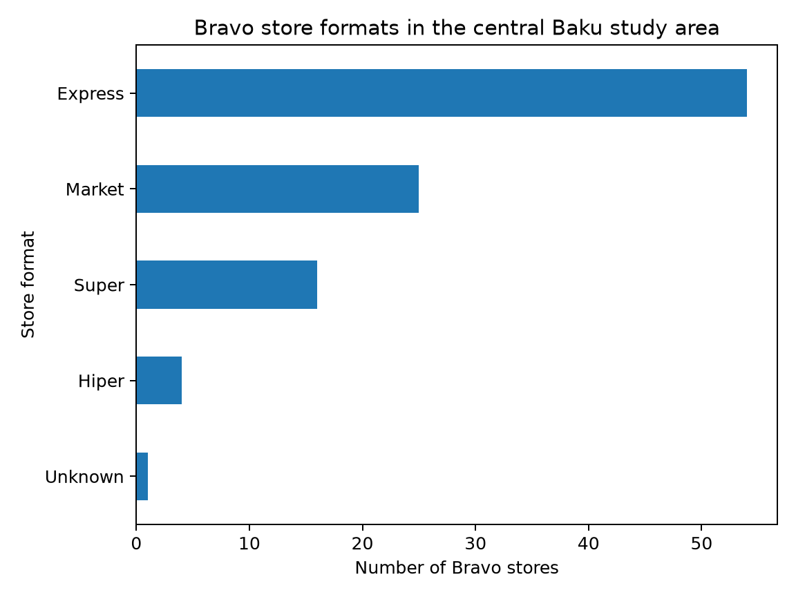
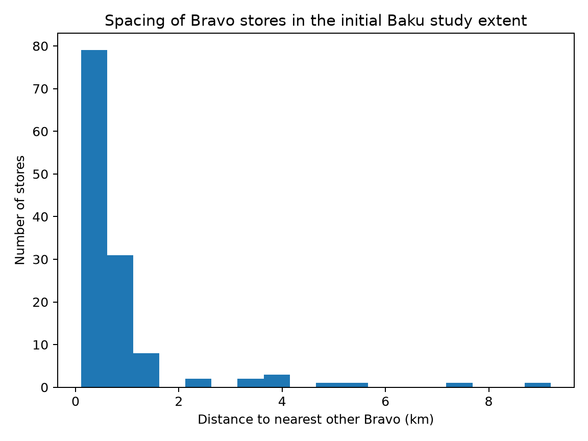

# Bravo Expansion Analysis

A location analytics project that uses public data to study Bravo's current store network in Baku and identify areas that may deserve closer investigation for future expansion.

## Business question

**Where in Baku are there populated, accessible areas with relatively weak Bravo coverage and enough room to justify more detailed site research?**

This project is a decision-support analysis. It does not claim to know Bravo's internal sales, rents, margins, customer data or property pipeline.

## Planned analysis

1. Collect Bravo's current store locations, formats, addresses and opening hours from Bravo's official store page.
2. Map the existing network and separate Hiper, Super, Market and Express formats.
3. Add public context data for nearby supermarkets and public transport.
4. Add a demand signal using population or residential-density data.
5. Divide Baku into comparable geographic cells.
6. Calculate features such as:
   - distance to the nearest Bravo
   - number of Bravo stores within a local radius
   - competitor density
   - distance to public transport
   - population or residential intensity
7. Build a transparent expansion score and compare it with simpler baselines.
8. Hold out a subset of existing Bravo locations to test whether the scoring method ranks their areas highly.
9. Produce a map of candidate areas and a short business summary of the strongest signals and limitations.

## Current findings

The first network pass collected **144 official Bravo locations**, of which **143 have usable coordinates**. The deliberately broad initial Baku study extent contains 129 of them.

Within that first-pass study extent:

- **67 stores are Express locations**, or 51.9% of the network
- the median distance to the nearest other Bravo is **0.53 km**
- **83.7%** of stores have another Bravo within 1 km
- the most isolated current location in the study extent is Bravo Hovsan, about **9.2 km** from the nearest other Bravo

That density is important. A simple "far from the nearest Bravo" rule would be too weak for a real expansion recommendation.





The geographic context layer currently contains **1,142 mapped supermarket/convenience features** and **188 public-transport features** from OpenStreetMap.

The first 1 km coverage grid contains **167 candidate cells** inside the Baku boundary. It measures Bravo coverage, competitor density and transit access. The current `coverage_gap_score` is deliberately only a baseline. Population and demand signals still need to be added before any candidate area is treated as an expansion recommendation.

See [outputs/network_summary.md](outputs/network_summary.md) for the detailed first-pass findings and [METHODOLOGY.md](METHODOLOGY.md) for the scoring design.

## Repository structure

```text
.
├── data/
│   ├── raw/
│   └── processed/
├── outputs/
├── src/
│   ├── collect_bravo_stores.py
│   ├── collect_osm_context.py
│   ├── collect_population.py
│   ├── validate_bravo_data.py
│   ├── analyze_bravo_network.py
│   ├── map_bravo_network.py
│   └── build_coverage_grid.py
├── sql/
│   └── 01_network_summary.sql
├── DATA_SOURCES.md
├── requirements.txt
└── README.md
```

## Run locally

Create an environment and install the dependencies:

```bash
pip install -r requirements.txt
```

Collect Bravo stores:

```bash
python src/collect_bravo_stores.py
```

Validate the store snapshot and build an interactive first-pass network map:

```bash
python src/validate_bravo_data.py
python src/map_bravo_network.py
```

Collect OpenStreetMap supermarket and transit context:

```bash
python src/collect_osm_context.py
```

For a quick SQL network summary:

```bash
duckdb < sql/01_network_summary.sql
```

The next stage adds official population data to the grid, then tests whether demand and accessibility features help recover the locations of existing Bravo stores.

## Output of the first collector

`data/raw/bravo_stores.csv` contains:

- store name
- store format
- address
- opening hours
- latitude and longitude
- whether the coordinates fall inside the initial Baku study bounding box
- source and Google Maps links
- collection timestamp

## Data quality

Public location data can be incomplete or inconsistent. Before scoring expansion areas, the project will:

- compare the scraped store count with Bravo's official page
- inspect duplicate or missing coordinates
- check outlier locations manually
- keep source URLs for traceability
- document any manual corrections

## Stack

**Python · pandas · GeoPandas · OSMnx · scikit-learn · DuckDB · Matplotlib · Folium**