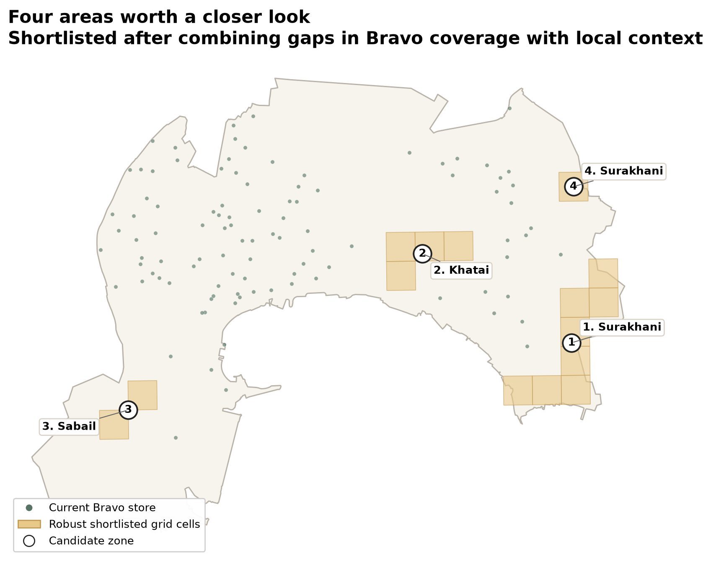
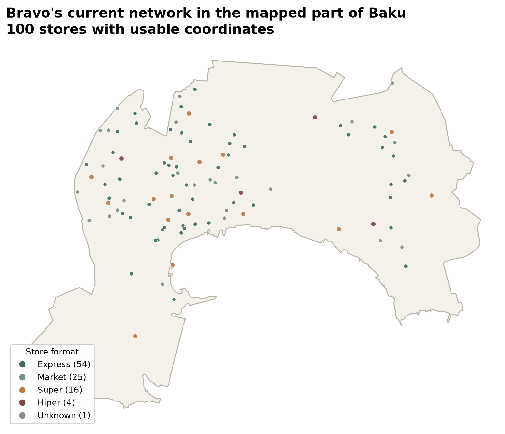

# Bravo Expansion Analysis

**Where could Bravo expand next in Baku?**

Bravo already has a dense network in the part of Baku covered by this analysis. I wanted to find places where there is still a real gap in Bravo coverage, but enough population and local activity to make the area worth checking more closely.

The result is a shortlist of **4 areas** for further review.



## What stood out

| Area | Why it stood out | What to check next |
| --- | --- | --- |
| **1. Surakhani** | Strong surrounding food-retail activity and a clear gap in Bravo coverage | Property economics, local competition and footfall |
| **2. Khatai** | By far the strongest population-density signal | Property availability, road access and cannibalisation |
| **3. Sabail** | Good population density with strong surrounding food-retail activity | Rent, footfall and site availability |
| **4. Surakhani** | The largest Bravo coverage gap in the shortlist | Whether lower population density is still enough to support another store |

These are **not final store recommendations**. They are areas that look worth investigating with data Bravo would have internally, such as rent, sales, property availability and customer catchments.

## The current network

I collected **144 Bravo locations** from Bravo's official store page. **143 had usable coordinates**, and **100 fall inside the Baku map polygon used for this analysis**.

Within that mapped area:

- **54%** of stores are Express locations
- the median store is only **0.47 km** from another Bravo
- **92%** of stores have another Bravo within 1 km

That is why simply looking for empty space would not be enough.



## How I got to the shortlist

I divided the mapped part of Baku into 1 km grid cells and looked at four things:

1. **Bravo coverage**  
   How far is the area from an existing Bravo, and how many Bravo stores are already nearby?

2. **Population**  
   How densely populated is the district?

3. **Local food retail**  
   How much supermarket and convenience-store activity is already nearby?

4. **Public transport**  
   How much mapped transport access is nearby?

I then built a simple model to test whether population, food-retail activity and transport help distinguish the kinds of areas where Bravo already operates.

A population-only model reached **0.659 ROC AUC**. Adding the wider local context increased district-held-out ROC AUC to **0.899**.

I combined that context score with the Bravo coverage gap, varied the weighting to check whether the result was stable, and grouped neighbouring high-scoring cells into broader areas.

That left **4 candidate areas**.

## The numbers behind the shortlist

| Area | Avg. distance to Bravo | Population density | Nearby food retailers |
| --- | ---: | ---: | ---: |
| **1. Surakhani** | 1.82 km | 1,745/km² | 41.1 |
| **2. Khatai** | 1.69 km | 9,260/km² | 13.5 |
| **3. Sabail** | 1.92 km | 3,403/km² | 25.0 |
| **4. Surakhani** | 2.05 km | 1,745/km² | 31.0 |

The food-retail count is useful as a signal of local activity, but it can also mean stronger competition. It should not be read as "more is always better."

## Data

- **Bravo Supermarket:** store names, formats, addresses, opening hours and map coordinates
- **State Statistical Committee of Azerbaijan:** 2026 district population and density
- **OpenStreetMap:** food-retail locations, public transport and the Baku map polygon

Source details are in [DATA_SOURCES.md](DATA_SOURCES.md).

## Open the outputs

- [Interactive current-store map](outputs/bravo_network_map.html)
- [Interactive expansion shortlist map](outputs/expansion_screen_map.html)
- [Executive summary](outputs/executive_summary.md)
- [Candidate-area decision matrix](outputs/decision_matrix.md)
- [Methodology](METHODOLOGY.md)

## Run it

```bash
git clone https://github.com/lamanmamed/bravo-expansion-analysis.git
cd bravo-expansion-analysis
pip install -r requirements.txt
python src/run_analysis.py
```

The full run rebuilds the store-network analysis, coverage grid, expansion screen, validation diagnostics, decision matrix and README maps from the committed data.

## Scope and limits

The analysis covers the **Baku polygon returned by OpenStreetMap**, not the full administrative territory of Baku. Outer Baku is not included.

The project also does not have Bravo's internal data on:

- rent and available properties
- store-level sales and margins
- customer catchments
- footfall
- parking and road visibility
- planned openings
- cannibalisation between store formats

So the output answers:

> **Which areas are worth checking next?**

not:

> **Where should Bravo definitely open a store?**

This is an independent portfolio project and is not affiliated with Bravo.

## Stack

**Python · pandas · GeoPandas · scikit-learn · DuckDB · Matplotlib · Folium**
