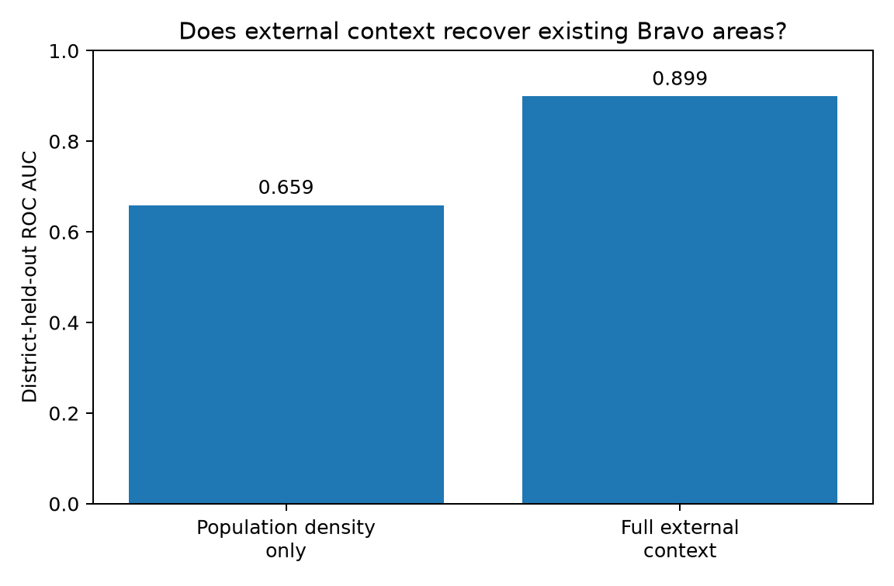
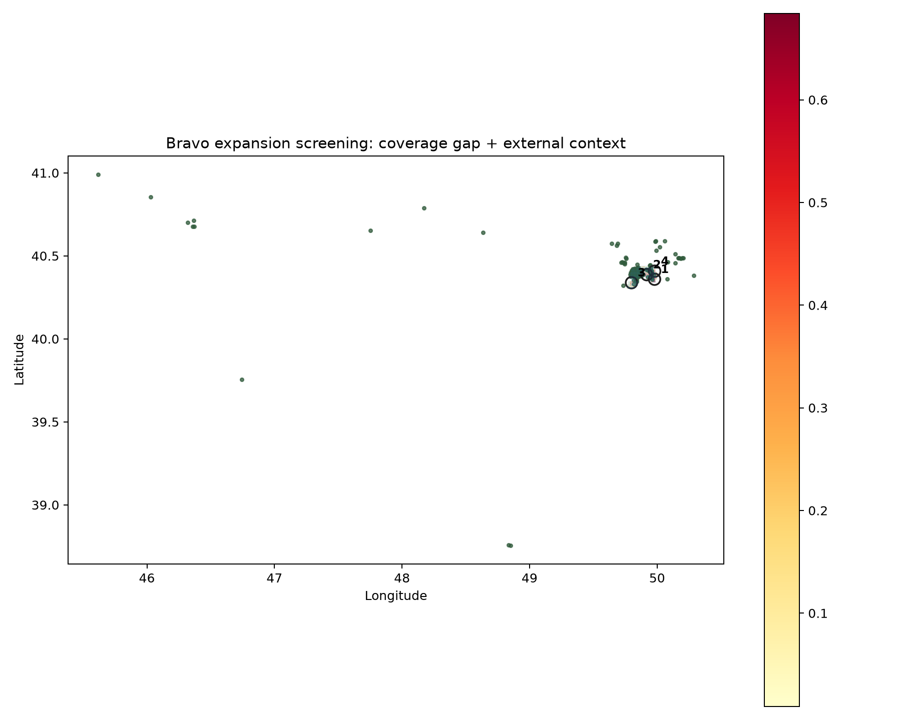

# Bravo Expansion Analysis

A public-data location analysis of Bravo's store network in Baku.

The project asks one business question:

> **Which parts of Baku combine a genuine gap in Bravo coverage with the kind of population, retail and accessibility context seen around existing Bravo stores?**

This is a screening tool for deciding where to investigate further. It is not a claim about where Bravo should open a store.

## Main findings

The official Bravo store page produced **144 locations**, with 143 usable coordinates. In the broad first-pass Baku study extent:

- 67 stores are Express locations, or **51.9%** of the network
- the median distance to the nearest other Bravo is **0.53 km**
- **83.7%** of stores have another Bravo within 1 km
- Bravo Hovsan is the most isolated current location in the first-pass extent, about **9.2 km** from the nearest other Bravo

That density matters. A simple "find somewhere far from Bravo" rule would mostly identify empty space, not necessarily good expansion opportunities.


## Does the external data contain a useful location signal?

I built a class-balanced logistic regression using only external context:

- 2026 district population density
- nearby non-Bravo food retail
- distance to the nearest non-Bravo food retailer
- nearby public transport
- distance to the nearest public-transport feature

Bravo distance and Bravo store counts were excluded from this model.

Validation holds out entire districts rather than randomly splitting neighbouring grid cells.

| Model | District-held-out ROC AUC |
| --- | ---: |
| Population density only | **0.659** |
| Full external-context model | **0.899** |

The result suggests that retail activity and accessibility add useful information beyond population density alone. It does not show that the model predicts store profitability.



## Expansion screening

Baku is divided into **167 one-kilometre grid cells**.

A cell is considered for expansion screening only if it is at least **1.5 km from the nearest current Bravo**. The final screen combines:

1. a **coverage-gap score**, based on distance from Bravo and nearby Bravo concentration
2. an **external context-fit score**, based on the validated model above

The two components are combined with a geometric mean so that a very remote area cannot rank highly if the external demand context is weak.

I then vary the coverage weight between 40%, 50% and 60%. Cells that remain near the top under multiple settings are grouped into broader zones rather than presented as separate neighbouring squares.

The current screen produces **47 eligible coverage-gap cells**, **15 robust cells** and **4 candidate zones**.

| Rank | District | Candidate cells | Mean distance to Bravo | Population density | Competitors within 1.5 km | Transit features within 1 km |
| ---: | --- | ---: | ---: | ---: | ---: | ---: |
| 1 | Surakhani | 8 | 1.82 km | 1,745/km² | 41.1 | 0.2 |
| 2 | Khatai | 4 | 1.69 km | 9,260/km² | 13.5 | 0.2 |
| 3 | Sabail | 2 | 1.92 km | 3,403/km² | 25.0 | 0.0 |
| 4 | Surakhani | 1 | 2.05 km | 1,745/km² | 31.0 | 0.0 |

These are **screening zones, not recommended store sites**. For example, the strongest Surakhani cluster has substantial surrounding food-retail activity but weak mapped transit coverage, which is exactly the kind of trade-off that should trigger deeper site research rather than an automatic "open here" conclusion.



The interactive version is available in [`outputs/expansion_screen_map.html`](outputs/expansion_screen_map.html).

## How the analysis works

```text
Bravo official store list
        |
        v
Existing network + store spacing
        |
        +------------------------+
        |                        |
        v                        v
OpenStreetMap retail       OpenStreetMap transit
        |                        |
        +-----------+------------+
                    |
                    v
          1 km Baku grid
                    |
                    v
Official 2026 Baku district population
                    |
                    v
External context model
(district-held-out validation)
                    |
                    + Bravo coverage gap
                    |
                    v
          Expansion screening
                    |
                    v
     Sensitivity check + zone clustering
```

See [`METHODOLOGY.md`](METHODOLOGY.md) for the full scoring and validation design.

## Data sources

### Bravo store network

Bravo's official store page is the primary source for store names, formats, addresses, opening hours and Google Maps coordinates.

### Population

The State Statistical Committee of the Republic of Azerbaijan provides population and density for Baku and its 12 districts as of **01.01.2026**.

### Retail and transport context

OpenStreetMap supplies supermarket/convenience-store and public-transport features. OSM is community maintained, so these counts are treated as context signals rather than a complete census.

See [`DATA_SOURCES.md`](DATA_SOURCES.md) for source details and links.

## Repository structure

```text
.
├── data/
│   ├── raw/
│   └── processed/
│       ├── bravo_store_metrics.csv
│       ├── coverage_grid.csv
│       ├── grid_district_assignments.csv
│       ├── expansion_screen_cells.csv
│       └── candidate_zones.csv
├── outputs/
│   ├── network_summary.md
│   ├── expansion_screen_summary.md
│   ├── bravo_network_map.html
│   ├── expansion_screen_map.html
│   └── charts and static map images
├── src/
│   ├── collect_bravo_stores.py
│   ├── collect_osm_context.py
│   ├── collect_population.py
│   ├── validate_bravo_data.py
│   ├── analyze_bravo_network.py
│   ├── build_coverage_grid.py
│   ├── assign_grid_districts.py
│   └── build_expansion_screen.py
├── sql/
│   ├── 01_network_summary.sql
│   └── 02_candidate_screening.sql
├── DATA_SOURCES.md
├── METHODOLOGY.md
├── requirements.txt
└── README.md
```

## Run locally

Install the dependencies:

```bash
pip install -r requirements.txt
```

The repository already contains the current public-data snapshot and generated outputs.

To rebuild the main analysis from the committed data:

```bash
python src/analyze_bravo_network.py
python src/build_coverage_grid.py
python src/build_expansion_screen.py
```

To refresh the official Bravo and population sources:

```bash
python src/collect_bravo_stores.py
python src/collect_population.py
```

Grid-to-district assignment uses rate-limited Nominatim reverse geocoding:

```bash
python src/assign_grid_districts.py
```

OpenStreetMap context can be refreshed with:

```bash
python src/collect_osm_context.py
```

Public Overpass servers can be slow or temporarily unavailable, so the repository keeps a reproducible committed OSM snapshot rather than requiring a fresh API pull every time the analysis is run.

For the SQL views and business-facing queries:

```bash
duckdb < sql/01_network_summary.sql
duckdb < sql/02_candidate_screening.sql
```

## Limitations

This analysis cannot observe the variables that would matter for a real site decision, including:

- rent and property availability
- store-level sales and margins
- basket size
- footfall
- road visibility and parking
- delivery catchments
- cannibalisation between Bravo formats
- planned store openings

District population density is also much coarser than the 1 km analysis grid.

The output should therefore be read as:

> **"These zones deserve closer investigation with internal commercial data."**

not:

> **"Bravo should open a store here."**

## Stack

**Python · pandas · GeoPandas · scikit-learn · DuckDB · Matplotlib · Folium**
